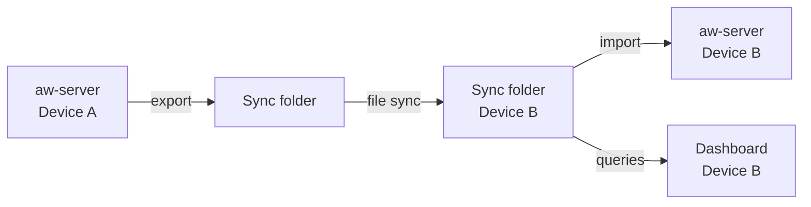

ActivityWatch includes experimental sync support via `aw-sync`, a tool that reads from and writes to a sync folder on your local filesystem. Combined with a file-sync service like Syncthing or Dropbox, you can merge activity data from multiple devices into a single unified dashboard. Because `aw-sync` operates on exported files rather than a central server, your data stays under your control — no third-party service ever has direct access to the ActivityWatch database.

## How sync works

`aw-sync` acts as a bridge between the local `aw-server` and a shared folder that a file-sync tool keeps in sync across devices:

1. `aw-sync` reads events from the local `aw-server` and exports them as JSON files into the sync folder — one file per device/bucket combination.
2. A file-sync tool (Syncthing, Dropbox, or any shared folder solution) copies the sync folder to your other devices.
3. On each remote device, `aw-sync` reads the JSON files placed there by the sync tool and imports the events into that device's local `aw-server`.
4. The web dashboard on any device then shows activity from all synced devices together in the Buckets view.



<Info>
  The sync folder contains one JSON file per device/bucket. You can inspect these files directly, back them up manually, or use them to restore data to a fresh ActivityWatch installation.
</Info>

## Setting up sync with Syncthing

Syncthing is a free, open-source, decentralized file synchronization tool that works well with `aw-sync` because it synchronizes folders directly between devices without passing through any central server.

<Steps>
  <Step title="Install Syncthing on all devices">
    Download and install Syncthing from [syncthing.net](https://syncthing.net/) on every device you want to sync. Syncthing provides native packages for Windows, macOS, and Linux.

    Start Syncthing and open its web interface (usually at `http://localhost:8384`) on each device.
  </Step>
  <Step title="Configure a shared sync folder">
    On the first device, add a new folder in the Syncthing interface — for example, `~/activitywatch-sync` — and share it with your other devices by adding them as remote devices in Syncthing.

    Accept the shared folder on each remote device and choose a local path (for example, `~/activitywatch-sync`) where the synced files will be stored.

    Wait for Syncthing to complete an initial sync between the devices before proceeding.
  </Step>
  <Step title="Run aw-sync pointing to the shared folder">
    Run `aw-sync` on each device, pointing it to the shared sync folder. `aw-sync` will export local activity data into the folder and import any files created by other devices:

    ```bash
    aw-sync --sync-dir ~/activitywatch-sync
    ```

    You can run `aw-sync` on a schedule (for example, with a cron job or a systemd timer) to keep the exported data up to date:

    ```bash
    # Example cron entry: run aw-sync every 15 minutes
    */15 * * * * aw-sync --sync-dir ~/activitywatch-sync
    ```
  </Step>
  <Step title="Verify data from other devices appears in the dashboard">
    Open the ActivityWatch web dashboard at `http://localhost:5600` and navigate to the **Buckets** view. You should see buckets from your other devices listed alongside your local buckets. Events from remote devices appear in the timeline and activity views alongside local data.
  </Step>
</Steps>

## Sync status

`aw-sync` is bundled with the Rust server implementation, `aw-server-rust`, and is built alongside it when you compile ActivityWatch from source with the Rust backend. In release packages, `aw-sync` is included as a standalone binary in the `aw-server-rust/` directory of the distribution.

Sync is considered **experimental**. It is functional for the described use case but has not been through the same level of production testing as the core server and watchers. Edge cases — such as clock drift between devices, very large datasets, or concurrent writes — may produce unexpected results.

<Warning>
  Sync is a one-way merge operation. When `aw-sync` imports events from another device, those events are added to the local database. Deleting events on one device does not propagate the deletion to other synced devices. If you want to remove data from all devices, you must delete it on each device individually.
</Warning>

<CardGroup cols={3}>
  <Card title="Configuration" icon="sliders" href="/configuration">
    Configure aw-server port, storage backend, and watcher settings.
  </Card>
  <Card title="Privacy" icon="shield" href="/privacy">
    Understand what data ActivityWatch collects and where it is stored.
  </Card>
  <Card title="REST API" icon="code" href="/developer/api-overview">
    Use the REST API to query, export, and delete activity data.
  </Card>
</CardGroup>
